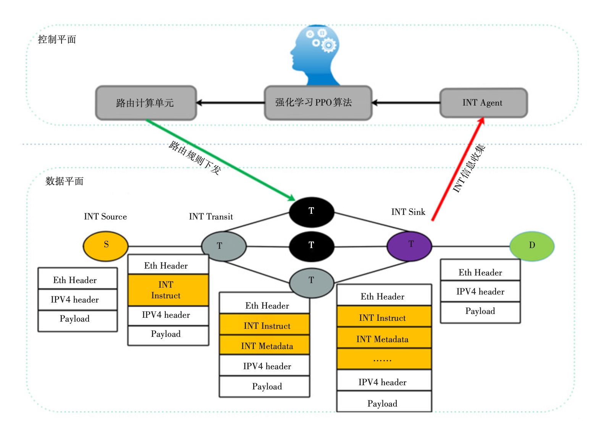

# Router Decision Paper

# 基于P4和机器学习的路由选择方案探讨

出处：邮电设计技术 0.707

年份：2018 

作者：李倩 

团队：北邮 

关键词：强化学习、路由选择

概述：基于P4和强化学习的路由选择方案，路由决策，最大链路利用率的比值，基于PPO强化学习算法与ECMP算法比较。

研究的问题：现有方法及优缺点：监督学习、非监督学习无法做到最优化主体的表现。

论文提出的思路和方法，及优缺点

论文使用的数据集：自己采集

工具：P4数据层采集工具；强化学习算法：PPO

论文使用的实验方法：

# Learning To Route

出处：Proceeding HotNets-XVI Proceedings of the 16th ACM Workshop on Hot Topics in Networks Pages 185-191

年份：2017

作者：Asaf Valadarsky

团队：Hebrew University of Jerusalem

关键词：

Reinforcement Learning, Intradomain Route Configuration, Demand Matrix, Routing Strategy, Softmin

概述：

域内流量工程的经典设置。 有关数据驱动路由，应用ML（特别是深度强化学习）可产生高性能，并且是进一步研究的有希望的方向。 

研究的问题：

ML-guided routing the optimization of routing within a single, self-administered network.

(1) How should routing be formulated as an ML problem? 

(2) What are suitable representations for the inputs and outputs of learning in this domain? 

现有方法及优缺点：

- supervised learning ，supervised learning might be ineffective if the traffic conditions do not exhibit very high regularity

论文提出的思路和方法：

- a model for data-driven (intradomain) routing that builds on the rich body of literature on intradomain TE and (multicommodity) flow optimization. 
- For Question (2)，devise methods for constraining the size of the output without losing “too much” in terms of routing expressiveness，leverage ideas from the literature on **hop-by-hop**

论文使用的数据集：

工具：P4数据层采集工具；强化学习算法：PPO

论文使用的实验方法：

- 名词

（1）**Network**：a capacitated directed graph $G=(V, E, c)$，where V and E are the vertex and edge sets, respectively, and $c: E \rightarrow \mathbb{R}^{+}$ assigns a capacity to each edge. 

（2）**Routing**：$\Gamma(v)$denote vertex v’s neighboring vertices in G.$\mathcal{R}_{v,(s, t)}: \Gamma(v) \rightarrow[0,1]$，such that $\mathcal{R}_{v,(s, t)}(u)$ is the **fraction** of traffic from $s$ to $t$ **traversing** v that v forwards to its neighbor u. $\sum_{u \in \Gamma(v)} \mathcal{R}_{v,(s, t)}(u)=1$（no traffic is blackholed at a non-destination），and，$\sum_{u \in \Gamma(v)} \mathcal{R}_{t,(s, t)}(u)=0$（all traffic to a destination is absorbed at that destination ）

（3）**Induced flows of traffic**：***demand matrix*** (DM) （the realistic scenario in which the DM is not known beforehand.）D is a $n×n$ ，$D_{i, j}$specifies the **traffic demand** between source i and destination j。（好像是每个vertex的流量，可以层层递推）

（4）**evaluate traffic flow**：**minimizing link (over) utilization** 。The link utilization under a specific multicommodity flow $f$ is $\max _{e \in E} \frac{f_{e}}{c(e)}$， $f_e$ is the total amount of flow traversing edge $e$ under flow $f$ 。

（5）**Routing future traffic demands **：the routing strategy $\mathcal{R}^{(t)}$ for that epoch is decided ，can depend only on the history of ***past*** traffic patterns and routing strategies (from epochs 1, . . . , t − 1). 

- Supervised Learning Approach 

the learning algorithm observes the **history** of DMs up to the current epoch, and predicts the DM for the **upcoming** epoch. This prediction is then used to **generate an optimal routing strategy** with respect to the predicted DM. 

the (deterministic) **gravity model** and the (probabilistic) **bimodal model**. （确定模型：通信输出与带宽成比例的场景，概率模型：端点分为小流量和大流量场景）

 also consider “***sparsifications***” of gravity/bimodal DMs generated by selecting, uniformly at random, a **p-fraction** of the communicating pairs, for some choice of p ∈ [0, 1], and **removing** the traffic demands（DMs） of all other pairs from consideration. 

**Class I**: DM sequences in which the next DM is *deterministically* derived from past DMs. 

**Class II**: DM sequences in which each DM is **independent** of the previous DMs.

- Reinforcement Learning Approach 

未来可能的应用方向：

(1) extending our approach to other routing contexts

(2) examining other performance metrics

(3) identifying better supervised learning approaches to traffic-demand estimation

(4) scaling reinforcement learning in this context, and beyond.

# A Survey on Deep Learning for the Routing Layer of Computer Network 

出处：UK/ China Emerging Technologies (UCET)

年份：2019

作者：Fengling Jiang 

团队：合肥师范大学，*Edinburgh Napier University* 

关键词：Deep learning, Computer network, Routing layer, Reinforcement learning 

概述：概述了计算机网络中路由层的深度学习方法。

研究的问题：现有方法及优缺点：监督学习、非监督学习无法做到最优化主体的表现。

论文提出的思路和方法，及优缺点

论文使用的数据集：自己采集

工具：P4数据层采集工具；强化学习算法：PPO

论文使用的实验方法：

# Losing control of the internet-using the data plane to attack the control plane

关键词：DDoS，BGP，botnet，Internet，CXPST，ZMW

总结：

提出了CXPST（Coordinated Cross Plane Session Termination）方法，利用僵尸🧟‍♂️网络影响core AS，目的是使core AS不断更新 BGP route，导致control plane的不稳定。

1. 大量发送请求网络拥塞，导致core AS数据平面拥塞，进一步使得BGP session失败，core AS 离线。
2. core AS恢复前，相邻fringe ASes Upate路由，发往core AS的流量将dropped，随后流量导向别的AS路由，Botnet Attacker停止攻击。
3. core AS恢复后，发送OPEN请求更新路由表rib，相邻fringe ASes 响应请求，传递路由表。Botnet Attacker再次进行攻击，如此往复。

反复的Update引发路由flapping，影响逐渐扩散，系统负载增加，cripping整个Internet control plane。

## Introduction

数据平面（data plane）、控制平面（control plane）

（有结论二者是会相互影响的）

在路由问题中，控制平面是为了解决链接故障，从而提高本地稳定性。但是为了稳定本地系统，将会对全局产生影响，这将会导致整个Internet的不稳定。router mis-configuration，hardware failure，as side-effects（副作用） of a fast-propagating worm都可能引起这一问题。

## Background

### 1

core ASes：具有high degree of connectivity （连结中心）

fringe ASes: 不怎么重要的AS，往往需要借助core AS 传播流量。

### 2

当网络环境变化时，route的变化：withdrawing routes, determine new routes, and advertising changes

正常运行的路由器将继续向不存在的路由器转发流量，直到完成寻找新路由的过程为止。指向故障路由器的所有流量都将被丢弃。 只有在受影响的路由器完成BGP消息的处理后，才能恢复数据平面功能。 在发生大量不稳定情况的情况下，路由器CPU的负载会急剧增加，可能会超过已经负担的路由处理器的容量。

### 3

ZMW，利用受害端data plane的拥塞，欺骗一对router断开之间的连结。导致BGP失败，失败会引起route的重新计算。

## CXPST

1. **Selecting Targets**:  $C_{B}(e)=\sum_{s \neq t \in V}path_{st}(e)$，表示：s与t之间与e有关的路径。Attacker可以生成链路的BGP之间的粗略度量。每当汇总的traceroute数据新加入一条边时，它就会代表一条跨越给定链接的单独路线。
2. **Dealing With Changing Topology:** 不仅要检查给定路径是否包含目标链接，还必须确保该路径也不包含其他目标链接。这样，当定位的链接失败时，攻击流量将不会重新路由。
3. **Fixing the Flow Issue:** 为了在到达目标链接之前最大程度地减少拥塞，攻击者应保持攻击流量**散布**，直到到达目标为止。当攻击流量到达目标链接时，攻击流将**聚合**在一起，从而导致该链接上的拥塞。**Attacker -> Link -> Destination Net**。（1）MaxFlow算法，确定使用的Botnet（2）流量分析，确定流量目的地。
4. **Thwarting Defenses:** Botnet设置时间窗口，当目标Link在时间内未重新出现，那么将重新选择Link，再次攻击目标Net。

## SIMULATION

1,829 ASes and 13,000 edges 

AS links we use **OC-768** size links, the largest link size currently in the SONET standard, for those links. In the same spirit we connect all fringe ASes, where the majority of the attacker’s resources reside, with **OC-3** links. 

IP addresses of infected machines were mapped to their parent ASes using the **GeoIP** database 

To ensure a proper lower bound for attacker bandwidth, bots were given a basic **ADSL** connections with an upload capacity capped at 1.0 Mbit/sec. 

**CDF**（Cumulative Distribution Function）：累积分布函数，评估AS攻击前后的负载变化情况